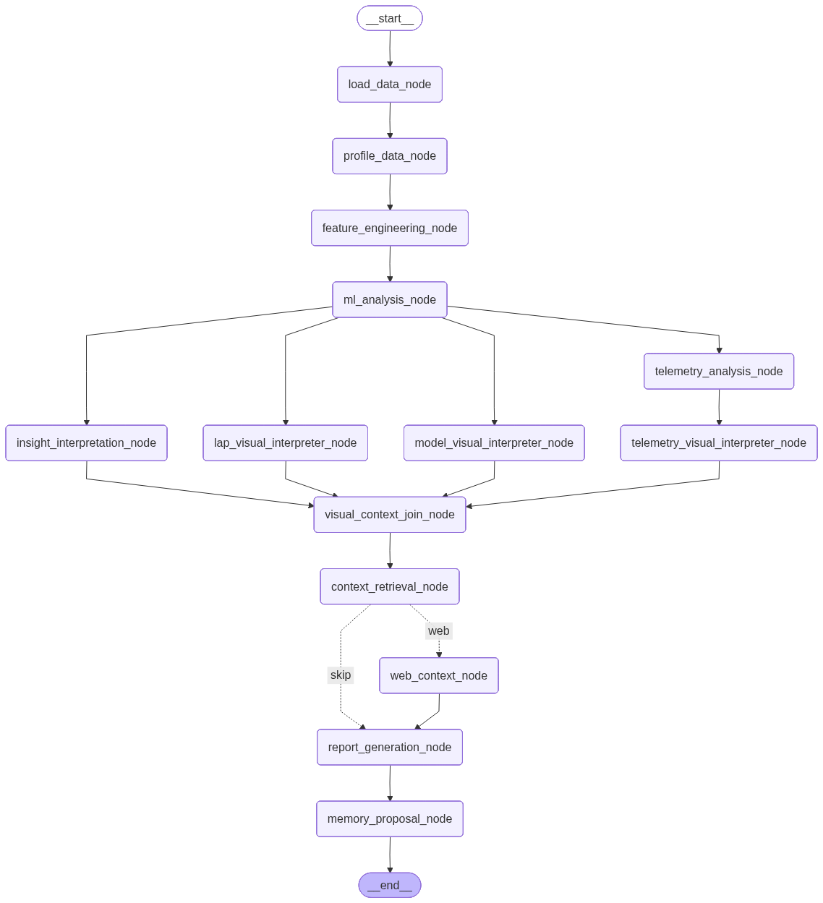

# f1-intelligence-agent


Agentic Formula 1 telemetry intelligence app built with FastF1, pandas, scikit-learn, LangGraph, Chroma, OpenAI, Plotly, and Gradio.

The app loads real F1 sessions, engineers lap and telemetry features, detects unusual driver/lap patterns, separates individual anomalies from session-wide regime events, interprets plots with deterministic visual agents, retrieves local F1 knowledge, generates a cautious analyst report, and supports human-approved memory.

## Highlights

- FastF1 ingestion for laps, weather, race-control messages, and selected telemetry.
- Lap-level feature engineering for sectors, speed traps, tyres, weather, pit flags, track status, missingness, and driver/regime-relative deltas.
- Inspectable unsupervised ML with DBSCAN, Isolation Forest, PCA, robust feature explanations, and model-row diagnostics.
- Parallel LangGraph workflow with visual interpretation agents and telemetry deep dives before report generation.
- Gradio UI for session selection, data preview, ML plots, visual interpretations, reports, and HITL memory approval.

## Workflow




## Quick Start

```bash
uv sync --extra dev
cp .env.example .env
```

Set `OPENAI_API_KEY` in `.env`.

Run the app:

```bash
uv run app/gradio_app.py
```

Open:

```text
http://127.0.0.1:7860/
```

## Screenshots


